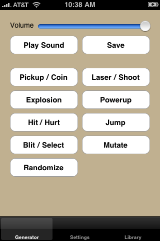
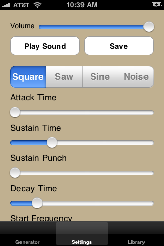
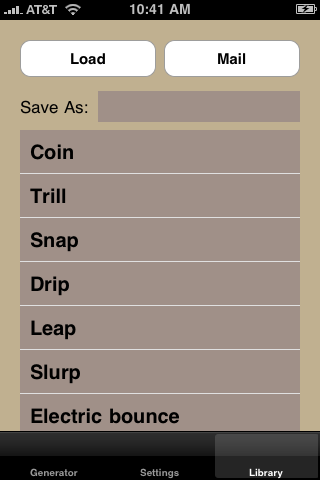

# sfxr - An iOS Port
sfxr - Sound Effect Generator by DrPetter, ported to iOS.

## About

sfxr is a software-based audio synthesizer created by DrPetter for use in Ludum Dare competitions. The program allows anyone to quickly synthesize original sound effects for video games. sfxr as popular among a certain group of independent game developers and other multimedia artists. It may be describe it as having a bit of a cult following.
The original version was implemented in a straight-forward manner using C, and the SDL library. It was a desktop application.

I was interested in learning more about the native iOS GUI framework, CocoaTouch. Recreating the sfxr GUI in CocoaTouch seemed like a reasonably sized project. It took about a week of part-time work in the evenings. And, one more week of evenings to profile and make the performance acceptable on the older model iPhones; that many of us were still using (I believe, I had an iPhone 3G at the time).

The application was free on Apple’s app store for a couple of years. Thousands of people downloaded it. The source code was hosted by Google code. I’ve since relocated here.

## Differences From The Original sfxr

- Obviously, the GUI is completely different. It would have to be redesigned and rewritten to look decent on modern iOS devices.
- I had taken the liberty of converting the main synthesis engine into a C++ class. This was initially motivated just to help the process of decoupling the sfxr synth engine from the SDL-based GUI. Because this process was motivated out of a desire to just “make it work,” and not from a place of Object Oriented Design, it’s not what I would consider beautiful code. If I were to spend more time on it (not likely), I’d consider making the result a little more modern and slightly less ugly for others.
- Nevertheless, wrapping the engine in a class produces the side effects (see what I did there?) of making the synth engine a little easier to cut & paste into different projects, and to easily facilitate multiple instances of the engine simultaneously within the one application.
- The only difference with in how the actual synthesis works, that I can remember, is that the standard C library rand() function was replaced with a linear-feedback shift register algorithm. The rand() function turned out to be too slow on older ARM processors. Since it was only used for synthesizing static, I switch to a less random, but easer to compute method.

## Screenshots

### Please see DrPetter’s original [readme.txt](readme.txt) for further details.